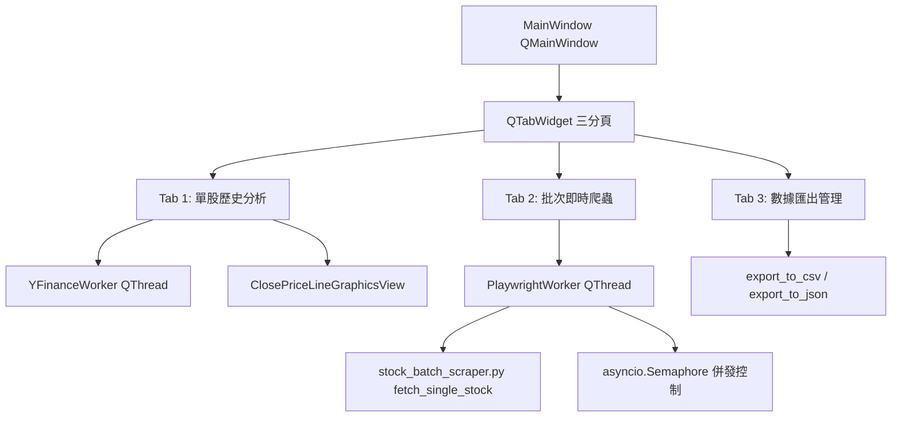

# 🎨 產品需求規格書 (PRD3.md) - practice5.py 終極整合版
> **專案目標**：將目前的 [practice5.py](file:///Users/roberthsu2003/Documents/GitHub/2026_06_17_playwright/lesson17/practice5.py)（yfinance 歷史行情 + Qt Graphics View 折線圖）與 [main.py](file:///Users/roberthsu2003/Documents/GitHub/2026_06_17_playwright/lesson17/main.py) 及 [stock_batch_scraper.py](file:///Users/roberthsu2003/Documents/GitHub/2026_06_17_playwright/lesson17/stock_batch_scraper.py)（Playwright Async 批次即時爬蟲與 CSV/JSON 匯出）深度整合，打造全方位的 **台股雙引擎行情分析與批次爬蟲桌面系統**。  
> **核心技術**：Python 3.10+, **PySide6** (`QtWidgets`, `QtGui`, `QtCore`), **Async Playwright** (`playwright.async_api`), **Qt Graphics View Framework**, `twstock`, `yfinance`, `pandas`。  
> **適用對象**：提供給 AI Coding Assistant 作為極為嚴謹且具體的 PySide6 全功能整合開發依據。

---

## 📌 1. 專案目標與架構願景 (Project Vision & Architecture)

### 1.1 系統定位
本系統旨在提供個人投資者與資料分析師一個全功能桌面應用程式：
1. **雙資料引擎**：
   - **歷史數據引擎 (`yfinance`)**：下載個股歷史 K 線與收盤價，進行長時間範圍的技術面分析與折線圖繪製。
   - **即時爬蟲引擎 (`Async Playwright`)**：併發爬取台灣 Yahoo 股市即時盤中價格、漲跌幅、開高低收與即時資料時間。
2. **無縫 GUI 體驗**：
   - 採用 **`QTabWidget` 三分頁視窗架構**，區分「單股歷史分析」、「多股批次爬蟲」與「數據匯出管理」。
   - 所有網路爬蟲與 API 請求必須封裝於獨立 `QThread`，搭配 `asyncio` 事件迴圈，絕對確保 GUI 視窗零凍結 (Zero-Freezing)。

---

## 🎯 2. 整體介面佈局與 UI/UX 順序規劃 (UI Layout & Workflow)

視窗預設尺寸 `1360x850`，頂部採用 `QTabWidget`，分為三大核心分頁：

```text
====================================================================================
  📈 台股雙引擎行情分析與批次爬蟲系統 (practice5.py)
====================================================================================
  ┌───────────────────────────┬───────────────────────────┬───────────────────────────┐
  │ 📊 Tab 1: 單股歷史折線分析 │ 🚀 Tab 2: 批次即時爬蟲     │ 💾 Tab 3: 資料庫與檔案匯出  │
  └───────────────────────────┴───────────────────────────┴───────────────────────────┘
```

---

### 2.1 Tab 1: 📈 單股歷史行情與折線圖分析 (Single Stock Historical Analysis)

#### 介面順序與佈局：
1. **頂部搜尋控制列**：
   - 股票搜尋輸入框 (`QLineEdit`)：輸入代碼或名稱 (預設 `2330`)。
   - 時間範圍選單 (`QComboBox`)：`1mo`, `3mo`, `6mo`, `1y`, `2y`, `5y`。
   - 圖表類型選單 (`QComboBox`)：`📉 收盤價折線圖` (預設)、`📊 走勢K線圖`。
   - 查詢按鈕 (`QPushButton`)：觸發背景 `yfinance` 下載。
2. **中央區域 (QSplitter 左右分欄)**：
   - **左側**：`ClosePriceLineGraphicsView`（Qt Graphics View Framework 收盤價折線圖 + 漸層陰影 + 滑鼠吸附高亮 + 動態登場動畫）。
   - **左下方**：日期滑桿控制器 (`QSlider`)，提供精確按日滑動導覽。
   - **右側**：即時統計卡片 (`QLabel` 最高/最低/漲跌幅) + 歷史價格明細數據表格 (`QTableWidget`)。
3. **連動機制**：
   - 支援「圖表點擊」↔「滑桿位置」↔「表格反白行」三方雙向聯動。

---

### 2.2 Tab 2: 🚀 多股批次即時爬蟲 (Playwright Async Batch Scraper)

此分頁專門處理來自 `main.py` 與 `stock_batch_scraper.py` 的非同步併發爬蟲需求。

#### 介面順序與佈局：

```text
+-----------------------------------------------------------------------------------+
| ⚙️ 爬蟲模式與搜尋設定 (Scraper Configuration)                                       |
| [模式選單▼] 1. 預設熱門股 (2330,2317,2454,2308,3008)                                |
|             2. 關鍵字搜尋複選 (twstock)                                            |
|             3. 自訂股票代碼清單                                                    |
| 併行數 (Concurrency): [ 3 ▲▼]  [ ⚡ 開始批次爬取 ]  [ ⏹️ 中止爬蟲 ]                    |
+-----------------------------------------------------------------------------------+
| 🔍 關鍵字搜尋與股票選擇區 (當選擇模式 2 時啟用)                                       |
| 關鍵字: [ 晶圓   ] [ 搜尋 ] --> 勾選清單 (QListWidget with Checkboxes)             |
| [☑] 2330 - 台積電  [☑] 2303 - 聯電  [ ] 2337 - 旺宏  [☑] 2454 - 聯發科 ...        |
+-----------------------------------------------------------------------------------+
| 📊 批次爬取即時結果明細表 (QTableWidget)                                           |
| 代碼 | 名稱 | 即時價格 | 漲跌資訊 | 資料時間 | 開盤 | 最高 | 最低 | 昨收 | 狀態      |
+-----------------------------------------------------------------------------------+
| 📜 爬蟲即時日誌與進度 (Progress & Console Log)                                     |
| 進度條: [████████████████████░░░░░░░░░] 60% (3/5)                                 |
| 日誌: [2026-08-12 21:15:02] ⏳ [併行爬取中] 2330... 成功取得股價: 2445.00          |
+-----------------------------------------------------------------------------------+
```

#### 操作順序流程 (Workflow Order)：
1. **選擇爬取來源模式**：
   - **選項 A (熱門股)**：自動帶入 `2330, 2317, 2454, 2308, 3008`。
   - **選項 B (twstock 關鍵字搜尋)**：在輸入框輸入 `23` 或 `晶圓`，自動在下方 `QListWidget` 出現含複選框的清單，勾選欲爬取的股票。
   - **選項 C (自訂清單)**：直接在文字框輸入 `2330, 2317, 3008`。
2. **調整併發數 (`QSpinBox`)**：
   - 預設 `max_concurrency = 3`（允許範圍 1~5，避免過高觸發 Yahoo 防爬）。
3. **按下「⚡ 開始批次爬取」**：
   - 啟動背景 `PlaywrightWorker(QThread)`。
   - 介面按鈕轉為禁用，進度條切換為定量 `0% -> 100%`。
   - Playwright 以無頭模式 (`headless=True`) 自動非同步併發連線 Yahoo 股市。
4. **實時更新**：
   - 每完成一支股票，即時寫入中間的 `QTableWidget` 批次表格，並於下方日誌框追加訊息。
5. **完成提示**：
   - 全數爬取完畢時，跳出成功提示，並解鎖匯出按鈕。

---

### 2.3 Tab 3: 💾 資料庫與檔案匯出 (Data Export & Management)

#### 介面順序與佈局：
1. **匯出設定面板**：
   - 檔案格式選擇：`CSV (.csv)` 或 `JSON (.json)` 或 `兩者皆匯出`。
   - 檔案儲存路徑選擇 (`QFileDialog`)：預設存至 `output/stocks_batch_YYYYMMDD.csv`。
   - 一鍵匯出按鈕 (`QPushButton`)：呼叫 `stock_batch_scraper.py` 中的 `export_to_csv` / `export_to_json` 函式。
2. **數據預覽與歷史記錄**：
   - 顯示最新一次批次爬取的資料筆數、成功率與最後更新時間。
   - 提供表格預覽，確保資料匯出前無誤。

---

## 🛠️ 3. 技術架構與 Python 類別設計 (Technical Architecture)

實作模型需遵循以下模組分工與類別設計構建 [practice5.py](file:///Users/roberthsu2003/Documents/GitHub/2026_06_17_playwright/lesson17/practice5.py)：



### 3.1 Playwright 異步執行緒背景工作器 (`PlaywrightWorker`)

將 `stock_batch_scraper.py` 中的 `batch_fetch_stocks` 整合至 `QThread`，解決 Playwright `asyncio` 與 Qt 事件迴圈衝突問題：

```python
class PlaywrightWorker(QThread):
    """Playwright 批次爬蟲工作器 (QThread + asyncio)"""
    single_stock_done = Signal(dict)  # 每完成一支股票發送一次 (即時更新表格)
    batch_finished = Signal(list)     # 批次全部完成，回傳完整 list[dict]
    progress_signal = Signal(int, int) # completed_count, total_count
    log_signal = Signal(str)          # 日誌訊息
    error_signal = Signal(str)

    def __init__(self, stock_codes: List[str], max_concurrency: int = 3):
        super().__init__()
        self.stock_codes = stock_codes
        self.max_concurrency = max_concurrency
        self._is_cancelled = False

    def cancel(self):
        self._is_cancelled = True

    def run(self):
        # 於獨立執行緒中建立新的 asyncio 事件迴圈執行 Playwright
        loop = asyncio.new_event_loop()
        asyncio.set_event_loop(loop)
        try:
            results = loop.run_until_complete(self._async_batch_fetch())
            if not self._is_cancelled:
                self.batch_finished.emit(results)
        except Exception as e:
            self.error_signal.emit(str(e))
        finally:
            loop.close()

    async def _async_batch_fetch(self) -> List[Dict]:
        from stock_batch_scraper import fetch_single_stock
        from playwright.async_api import async_playwright
        
        results = []
        semaphore = asyncio.Semaphore(self.max_concurrency)
        total = len(self.stock_codes)
        completed = 0

        async with async_playwright() as p:
            browser = await p.chromium.launch(headless=True)
            context = await browser.new_context(
                user_agent="Mozilla/5.0 (Macintosh; Intel Mac OS X 10_15_7) AppleWebKit/537.36 (KHTML, like Gecko) Chrome/120.0.0.0 Safari/537.36",
                viewport={"width": 1280, "height": 800}
            )
            
            async def worker(code: str):
                nonlocal completed
                if self._is_cancelled:
                    return None
                async with semaphore:
                    self.log_signal.emit(f"⏳ [併行爬取中] 股票代碼: {code} ...")
                    data = await fetch_single_stock(context, code)
                    completed += 1
                    self.progress_signal.emit(completed, total)
                    self.single_stock_done.emit(data)
                    self.log_signal.emit(f"✅ [爬取成功] {data.get('股票名稱', code)} ({code}): NT$ {data.get('即時價格', 'N/A')}")
                    await asyncio.sleep(0.5)
                    return data

            tasks = [worker(c) for c in self.stock_codes]
            results = await asyncio.gather(*tasks)
            await browser.close()
            
        return [r for r in results if r is not None]
```

---

### 3.2 主要介面元件與邏輯繼承

1. **單股歷史分析**：
   - 繼續複用已實現之 `StockInfo`、`ClosePriceLineGraphicsView`（收盤價折線圖、陰影漸層、Hover 導引線與焦點圓點）。
   - 繼續支援「日期滑桿 (`QSlider`)」與「表格 row 點擊」雙向連動。
2. **批次即時爬蟲**：
   - 使用 `QListWidget` 配合 `QListWidgetItem` 與 `Qt.ItemFlag.ItemIsUserCheckable` 實現 twstock 搜尋後的勾選清單。
   - 使用 `QTextEdit` 作為底部的控制台即時輸出 Log。

---

## 🛡️ 4. 邊界情況與錯誤處理規格 (Error Handling)

1. **Playwright 啟動失敗**：
   - 若系統缺少 Playwright Chromium 瀏覽器二進位檔，捕捉例外並透過 `QMessageBox` 提示用戶執行 `uv run playwright install chromium`。
2. **重複點擊防禦**：
   - 點擊「開始批次爬取」後，立即將按鈕 `setEnabled(False)`，並啟動「中止爬蟲」按鈕。
3. **無效代碼/網路超時**：
   - `fetch_single_stock` 內部包含 `try...except` 容錯，當單一股票失敗時返回包含「錯誤訊息」的字典，不中斷其他股票的併發爬取。
4. **Qt DeprecationWarning 規範**：
   - 嚴格使用 PySide6 `event.position().toPoint()`，禁止使用已被棄用的 `event.pos()`。

---

## 📝 5. 實作步驟與執行清單 (Step-by-Step Implementation Plan)

- [ ] **Phase 1: 模組重構與依賴引入**
  - [ ] 確定 `stock_batch_scraper.py` 中的 `fetch_single_stock`、`export_to_csv` 與 `export_to_json` 可被 `practice5.py` 正確 import。
- [ ] **Phase 2: 撰寫 PlaywrightWorker 異步工作器**
  - [ ] 實現包含 `asyncio.new_event_loop()` 的 `PlaywrightWorker(QThread)`。
  - [ ] 測試與 `single_stock_done` 及 `progress_signal` 的連動。
- [ ] **Phase 3: 構建 QTabWidget 三分頁 UI 佈局**
  - [ ] **Tab 1**：搬移並保留 [practice5.py](file:///Users/roberthsu2003/Documents/GitHub/2026_06_17_playwright/lesson17/practice5.py) 現有的單股歷史折線圖與滑桿。
  - [ ] **Tab 2**：設計模式選單、twstock 勾選清單、批次表格與 Log 文字框。
  - [ ] **Tab 3**：設計 CSV / JSON 一鍵匯出介面與 `QFileDialog`。
- [ ] **Phase 4: 訊號槽綁定與三方連動測試**
  - [ ] 測試單股歷史折線圖 slider 雙向連動。
  - [ ] 測試批次即時爬蟲進度條與表格實時更新。
  - [ ] 測試檔案匯出功能。
- [ ] **Phase 5: 驗證與測試**
  - [ ] 執行 `uv run python lesson17/practice5.py` 通過驗收。

---

## 🧪 6. 驗收標準 (Acceptance Criteria)
1. **視窗正常啟動**：執行 `uv run python lesson17/practice5.py` 無報錯，彈出 1360x850 三分頁視窗。
2. **Tab 1 功能完整**：支援 2330 等個股的歷史收盤價折線圖繪製、陰影漸層、Hover 卡片與日期滑桿雙向連動。
3. **Tab 2 批次爬蟲成功**：點擊預設熱門股或搜尋勾選股票後，Playwright 成功併發爬取 Yahoo 股市即時盤中資料，表格與日誌實時滾動。
4. **Tab 3 匯出成功**：點擊匯出按鈕後成功在 `output/` 資料夾產出 UTF-8-SIG 的 CSV 與 JSON 檔案。

---

## 📁 7. 相關檔案路徑
- **主 GUI 程式**：[lesson17/practice5.py](file:///Users/roberthsu2003/Documents/GitHub/2026_06_17_playwright/lesson17/practice5.py)
- **爬蟲核心模組**：[lesson17/stock_batch_scraper.py](file:///Users/roberthsu2003/Documents/GitHub/2026_06_17_playwright/lesson17/stock_batch_scraper.py)
- **CLI 原型參考**：[lesson17/main.py](file:///Users/roberthsu2003/Documents/GitHub/2026_06_17_playwright/lesson17/main.py)
- **PRD3 規格檔案**：[lesson17/PRD3.md](file:///Users/roberthsu2003/Documents/GitHub/2026_06_17_playwright/lesson17/PRD3.md)
