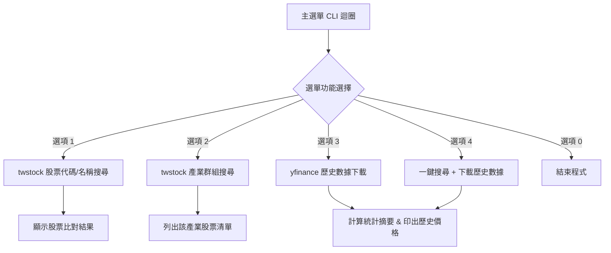

# 📋 需求規格書 (PRD) & 開發執行清單 (To-Do List)
> **專案名稱**：台股股票查詢與歷史行情 CLI 系統 (`practice2.ipynb`)  
> **技術棧**：Python, `twstock`, `yfinance`, `pandas`

---

## 🎯 1. 專案目標與定位 (Project Overview)
本專案旨在將 `lesson17/practice1.ipynb` 中的基本功能（`twstock` 股票清單查詢與 `yfinance` 歷史價格下載）進行模組化整合，打造一個在 Jupyter Notebook 中執行的**互動式 CLI (Command Line Interface) 股票查詢系統**。

使用者可透過簡單的命令列選單：
1. 查詢台股股票資訊（支援股票代號、關鍵字、產業別搜尋）。
2. 自訂時間區間抓取指定的個股歷史 K 線數據。
3. 檢視統計摘要（最高價、最低價、收盤價、成交量等）並預覽資料。

---

## 💡 2. 核心功能規格 (Core Features Specification)

### 2.1 股票搜尋與篩選模組 (`twstock` 整合)
- **代碼/名稱搜尋**：輸入股票代號（如 `2330`）或名稱關鍵字（如 `台積電`），自動返回對應的股票資訊（代號、名稱、市場類別、產業群組）。
- **產業別分類查詢**：輸入產業關鍵字（如 `半導體`、`金融`、`航運`），列出該產業下所有的股票清單。
- **市場類別辨識**：自動識別該股票為「上市 (`.TW`)」或「上櫃 (`.TWO`)」，以便後續正確傳給 `yfinance`。

### 2.2 歷史行情抓取模組 (`yfinance` 整合)
- **快捷時間區間選單**：
  - `1`: 過去 1 個月 (`1mo`)
  - `2`: 過去 3 個月 (`3mo`)
  - `3`: 過去 6 個月 (`6mo`)
  - `4`: 過去 1 年 (`1y`)
  - `5`: 自訂日期區間 (格式：`YYYY-MM-DD` 至 `YYYY-MM-DD`)
- **數據統計與展示**：
  - 顯示資料筆數與時間範圍。
  - 計算並展示期間內的：最高價 (High)、最低價 (Low)、平均收盤價 (Avg Close)、最新收盤價 (Latest Close)、平均成交量 (Avg Volume)。
  - 顯示前 5 筆與後 5 筆 K 線歷史數據預覽。

### 2.3 互動式 CLI 選單介面 (`input()` 選單迴圈)
主選單選項結構：
```
==================================================
  📈 台股股票歷史數據查詢系統 (CLI 介面)
==================================================
  [1] 搜尋股票 (依代號/名稱)
  [2] 依產業別篩選股票
  [3] 抓取個股歷史行情 (yfinance)
  [4] 快速查詢並下載數據 (一鍵流程)
  [0] 離開系統
==================================================
```

---

## 🛠️ 3. 系統架構與模組設計 (Architecture & Functions)



### 主要 Python 函式規劃：
1. `format_ticker(code: str) -> str`: 判斷 `twstock` 市場類別，回傳 `xxxx.TW` 或 `xxxx.TWO`。
2. `search_stock_info(keyword: str)`: 搜尋個股並顯示詳細資訊。
3. `filter_stocks_by_group(group_name: str)`: 依產業別列出所有相關個股。
4. `get_stock_history(symbol: str, period: str = "1mo", start_date: str = None, end_date: str = None)`: 下載並整理行情 DataFrame。
5. `display_stock_summary(symbol: str, df: pandas.DataFrame)`: 計算並印出行情統計數據。
6. `main_cli()`: CLI 互動選單主迴圈。

---

## 📝 4. 開發執行清單 (To-Do List)

- [ ] **Phase 1: 環境與工具函式準備**
  - [ ] 驗證 `twstock` 與 `yfinance` 套件是否正常運作。
  - [ ] 撰寫 `format_ticker()`：建立上市/上櫃代碼與 `.TW` / `.TWO` 的自動轉換邏輯。

- [ ] **Phase 2: 股票資訊查詢模組開發**
  - [ ] 撰寫 `search_stock_info()`：實現依股票代號或名稱關鍵字查詢。
  - [ ] 撰寫 `filter_stocks_by_group()`：實現依產業類別篩選股票清單。

- [ ] **Phase 3: 歷史數據下載與分析模組開發**
  - [ ] 撰寫 `get_stock_history()`：整合相對時間區間與自訂日期區間下載。
  - [ ] 撰寫 `display_stock_summary()`：計算最高價、最低價、最新收盤價及成交量，並格式化輸出。
  - [ ] 加入錯誤處理（如無效股票代號、查無數據、網路超時等容錯機制）。

- [ ] **Phase 4: CLI 互動選單整合與測試**
  - [ ] 設計 `main_cli()` 主迴圈與選單文字介面。
  - [ ] 測試個別選單流程與邊界情況（如輸入非法選項、無對應產業等）。
  - [ ] 在 `lesson17/practice2.ipynb` 中進行完整流程執行驗證。

---

## 🚀 5. 未來擴充規劃 (Phase 2 Roadmap)
- [ ] 增加 K 線圖與成交量圖表繪製 (`matplotlib` / `plotly`)。
- [ ] 支援將查詢到的歷史數據自動匯出為 `.csv` 或 `.excel` 檔案。
- [ ] 升級為 Streamlit 或 Gradio 的 Web GUI 視覺化介面。
