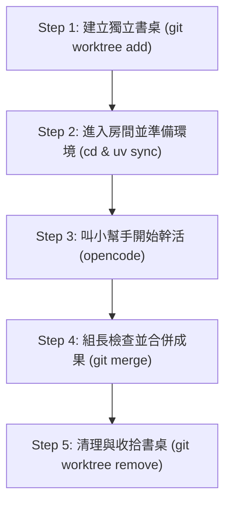

# 🎓 OpenCode Subagent 與 Git Worktree 學生實戰指南

歡迎來到 **OpenCode Subagent + Git Worktree** 的新手教學！
如果你覺得 Git 分支或 AI 小幫手（Subagent）聽起來很複雜，別擔心！這篇指南會用最簡單的生活比喻，帶你一步步學會如何讓 AI 幫你寫程式，而且完全不會弄亂你的原始專案。

---

## 💡 什麼是 Git Worktree？（生活小比喻）

想像你在做**分組報告**：
* 🏠 **原本的主目錄（`main` 專案）**：就像**客廳的大餐桌**，大家最終要把完成的報告疊在這裡。
* 🚪 **Git Worktree**：就像在旁邊**幫 AI 小幫手開一間獨立的小房間（獨立書桌）**。小幫手可以在裡面塗塗改改、嘗試各種寫法，完全不會把客廳餐桌上的東西弄亂！

### 為什麼要這樣做？
1. **安全隔離**：AI 在獨立房間亂試程式碼，就算寫壞了也不會影響你的主專案。
2. **平行處理**：你可以開多個房間，讓 AI 助手 A 寫功能一、AI 助手 B 寫功能二，互不干擾。
3. **成果清晰**：AI 完成後，你可以進房間檢查，覺得滿意再搬回客廳大餐桌（合併）。

---

## 👥 角色分工

在 OpenCode 的世界裡，有兩種主要角色：

| 角色 | 比喻 | 職責 |
| :--- | :--- | :--- |
| **主 Agent** | **組長 / 總指揮** | 負責拆解任務、幫小幫手開闢 Worktree 房間、審查成果並合併。 |
| **Subagent** | **組員 / 實作小助手** | 專心待在指定房間裡寫程式與做測試，完成後回報給組長。 |

---

## 🚀 5 步驟實戰流程

下面是讓 Subagent 在獨立 Worktree 工作的所有步驟：



### Step 1: 建立獨立書桌 (Worktree)

在主專案目錄下，先確認專案狀態，然後新增一個 Worktree：

```bash
# 1. 檢查目前狀況
git status --short

# 2. 建立一個名為 agent/implementer 的分支與獨立資料夾
git worktree add -b agent/implementer ../worktrees/agent-implementer main
```
> 💡 **意思解讀**：我們從 `main` 複製了一份乾淨的程式碼，放在 `../worktrees/agent-implementer` 這個新房間裡。

---

### Step 2: 進入房間並準備環境

進入剛建好的房間，並使用 `uv` 初始化 Python 環境：

```bash
# 進入新房間
cd ../worktrees/agent-implementer

# 使用 uv 安裝專案所需的套件與環境
uv sync --locked

# (選填) 如果專案有用到 Playwright 瀏覽器自動化，執行下式：
uv run playwright install
```

---

### Step 3: 喚醒 Subagent 小幫手

系統怎麼知道要使用哪一位小幫手（Subagent）呢？我們可以用以下兩種方式**「指名召喚」**它：

#### 方式 A：進入 OpenCode 後使用 `@` 呼叫（推薦）
在該房間目錄下啟動 OpenCode：
```bash
opencode
```
接著在對話框中輸入：
> 📝 **對話輸入範例**：
> 「**@implementer** 你現在位於獨立工作區 `agent-implementer`。你的任務是：實作登入頁面表單驗證。請在實作後執行測試命令驗證。完成後請列出修改的檔案與測試結果，不要自行修改其他目錄或直接 push/merge。」

#### 方式 B：在啟動時直接指定 Agent
```bash
# 直接以 implementer 角色啟動
opencode --agent implementer

# 或是直接在終端機一行交付任務：
opencode run -a implementer "實作登入頁面表單驗證並執行測試"
```

> 💡 **小知識：OpenCode 怎麼知道它是小幫手？**
> OpenCode 會讀取專案中 `.opencode/agents/implementer.md` 的設定檔（裡面定義了 `mode: subagent` 與權限限制）。當你加上 `@implementer` 或 `--agent implementer` 時，它就會套用小幫手的規則，乖乖留在指定房間裡工作！

---

### Step 4: 組長驗收與合併成果

當 Subagent 完成工作並回報後，**組長（你或主 Agent）**進行驗收：

```bash
# 1. 在 Worktree 內提交變更
git add .
git commit -m "feat: 新增登入頁面表單驗證"

# 2. 回到主專案大餐桌
cd ../../2026_06_17_playwright  # 切回你的主專案目錄
git switch main

# 3. 檢查小幫手做了什麼變更
git diff main...agent/implementer

# 4. 確認沒問題，正式合併！
git merge --no-ff agent/implementer
```

---

### Step 5: 收拾與清理書桌

當任務順利完成並合併後，把不需要的臨時房間與分支刪除，保持環境整潔：

```bash
# 1. 移除 Worktree 資料夾
git worktree remove ../worktrees/agent-implementer

# 2. 刪除已合併的臨時分支
git branch -d agent/implementer

# 3. 清理 Git 殘留紀錄
git worktree prune
```

---

### ⚙️ (補充) Subagent 設定檔參考

如果你想在專案中固定 Subagent 的行為，可以在專案的 `.opencode/agents/implementer.md` 放入以下設定：

```markdown
---
description: 在指定 worktree 實作單一功能並執行驗證
mode: subagent
permission:
  edit: allow
  bash: ask
  external_directory: deny
---

你只能在主 agent 指定的 worktree 工作。
請先閱讀需求與相關程式，再實作指定範圍。
不要修改其他 worktree，不要直接 push 或合併。
完成後請回報修改檔案、commit 訊息與測試驗證結果。
```

---

## ⚠️ 學生新手常見避坑指南

1. ❌ **忘記切換目錄**：在主專案裡直接叫 Subagent 改程式，這樣就失去了 Worktree 隔離的效果！
2. ❌ **密碼與敏感資料跟著提交**：切記不要提交 `.env`、API Key 或個人帳密等私密檔案。
3. ❌ **重複使用同一個房間名**：每次建立 Worktree 請使用唯一的名稱（例如 `agent-feature-a`），避免覆蓋既有成果。
4. 💡 **遇到合併衝突怎麼辦？**：如果 AI 改的地方剛好你也改到了，Git 會提示衝突。不要害怕，打開檔案找到 `<<<<<<<` 與 `>>>>>>>` 標記，保留正確的程式碼並重新 commit 即可。

---

## ⚡ 快速指令記憶卡 (Cheatsheet)

| 操作 | 指令 |
| :--- | :--- |
| **列出所有房間** | `git worktree list` |
| **建新房間** | `git worktree add -b <分支名> <路徑> main` |
| **安裝環境** | `uv sync --locked` |
| **刪除房間** | `git worktree remove <路徑>` |
| **清理紀錄** | `git worktree prune` |

---

🎉 **恭喜！** 你已經掌握了使用 Subagent 與 Git Worktree 的精髓，快去試試看讓 AI 小幫手在獨立房間為你寫程式吧！
