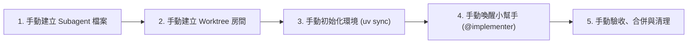
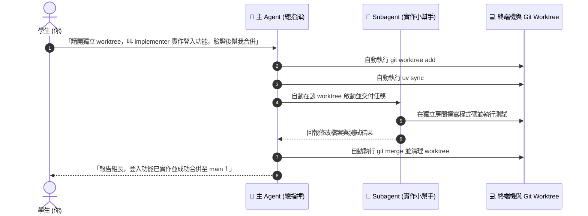

# 🎓 OpenCode Subagent 與 Git Worktree 全方位指南：從手動扎馬步到 AI 全自動調度

歡迎來到 **OpenCode Subagent + Git Worktree** 的教學手冊！  
本指南專為**學生與初學者**設計，透過直覺的生活比喻，帶你循序漸進：
* **Part 1【手動篇】**：親手操作一遍，弄懂 Subagent 與 Worktree 的底層原理。
* **Part 2【主動篇】**：進階技巧，只要下一道指令，讓「主 Agent（AI 組長）」自動幫你開房間、派工並合併！

---

## 💡 觀念導覽：什麼是 Worktree 與 Subagent？

想像你正在做**分組期末專案**：
* 🏠 **主專案目錄（`main`）**：就像**客廳的大餐桌**，大家最終要把完成的作業放上來。
* 🚪 **Git Worktree**：就像在旁邊**開闢一間獨立的小房間（獨立書桌）**，專門給 AI 小幫手在裡面寫程式。就算寫壞了，客廳大餐桌上的東西也完全不受影響！
* 👥 **角色分工**：
  * **主 Agent（或你自己）** = **組長 / 總指揮**：負責拆解任務、分配房間、審查成果與合併。
  * **Subagent** = **組員 / 實作小幫手**：專注在指定的獨立房間裡寫程式與做測試，完成後交給組長。

```mermaid
graph TD
    subgraph 客廳大餐桌 (主專案目錄)
        Main["main 分支 (乾淨穩定的程式碼)"]
    end

    subgraph 獨立小房間 (Git Worktree)
        WT["../worktrees/agent-implementer<br>(獨立開發環境 / 隨便改都不怕壞)"]
        Subagent["🤖 Subagent (實作小幫手)"]
        WT --- Subagent
    end

    Main -- "1. 開闢房間 (git worktree add)" --> WT
    WT -- "2. 驗收後合併成果 (git merge)" --> Main
```

---

## 🛠️ Part 1：【手動篇】一步步親手做（理解原理）

> 💡 **學習心法**：先手動走過一遍流程，你才會清楚實體檔案在哪裡、環境怎麼建的。當未來自動化出狀況時，你就能一眼看出問題！



### 步驟 1-1：手動建立 Subagent 角色檔案
在專案根目錄下建立 `.opencode/agents/implementer.md`，給小幫手一張「身份履歷表」：

```markdown
---
description: 在指定 worktree 實作單一功能並執行驗證
mode: subagent
permission:
  edit: allow
  bash: ask
  external_directory: deny
---

你只能在主 agent 指定的 worktree 工作。
請先閱讀需求與相關程式，再實作指定範圍。
不要修改其他 worktree，不要直接 push 或合併。
完成後請回報修改檔案、commit 訊息與測試驗證結果。
```
> 🔍 **重點解析**：
> * `mode: subagent`：告訴 OpenCode 它是一個「副手/小助手」。
> * `external_directory: deny`：給它一道安全護欄，禁止它跑出自己的房間去改別的目錄。

---

### 步驟 1-2：手動開闢獨立房間 (Worktree)
在主專案終端機中，確認狀態並新增一個獨立 Worktree：

```bash
# 1. 確認目前 Git 狀態乾淨
git status --short

# 2. 建立新分支 agent/implementer 並在獨立資料夾開闢房間
git worktree add -b agent/implementer ../worktrees/agent-implementer main
```
> 💡 此時 Git 會自動在 `../worktrees/agent-implementer` 建立一份完整的專案複本。

---

### 步驟 1-3：手動進入房間並初始化環境
進入剛建立的房間，並使用 `uv` 建立專屬的虛擬環境：

```bash
# 進入新房間
cd ../worktrees/agent-implementer

# 使用 uv 同步套件
uv sync --locked

# (若專案有 Playwright 需求)
uv run playwright install
```

---

### 步驟 1-4：手動喚醒小幫手並指名派工
在該房間目錄下啟動 OpenCode，並使用 `@` 指名小幫手：

```bash
opencode
```
在對話框中輸入：
> 📝 **對話輸入範例**：
> 「**@implementer** 你現在位於獨立工作區 `agent-implementer`。你的任務是：實作登入頁面表單驗證。請在實作後執行測試驗證。完成後請列出修改的檔案與測試結果，不要自行修改其他目錄或直接 push/merge。」

---

### 步驟 1-5：手動驗收、合併與收拾書桌
當 Subagent 完成並回報後，由你進行驗收與合併：

```bash
# 1. 在 Worktree 內提交變更
git add .
git commit -m "feat: 新增登入頁面表單驗證"

# 2. 回到客廳大餐桌（主專案目錄）
cd ../../2026_06_17_playwright
git switch main

# 3. 檢查小幫手改了什麼
git diff main...agent/implementer

# 4. 確認無誤，正式合併
git merge --no-ff agent/implementer

# 5. 清理不再需要的房間與分支
git worktree remove ../worktrees/agent-implementer
git branch -d agent/implementer
git worktree prune
```

---

## 🚀 Part 2：【主動篇】讓主 Agent 成為全能總指揮（進階自動化）

當你熟悉了 Part 1 的手動流程後，你會發現每次手動打這些指令有點繁瑣。  
這時候，你可以直接讓**主 Agent（總指揮）**幫你一手包辦！



### 步驟 2-1：主動模式的運作原理
主 Agent 本身具備執行終端機命令與調度檔案的能力。只要你在主專案給予它足夠明確的指示，它就能自動在背後依序完成「開 Worktree ➔ 環境同步 ➔ 調度 Subagent ➔ 跑測試 ➔ 合併 ➔ 清理」的所有步驟。

---

### 步驟 2-2：主動讓主 Agent 建立/擴充 Subagent 角色
如果你想新增一個新角色（例如專門寫測試的 `tester` 或審查程式碼的 `reviewer`），你不需要自己手動寫 Markdown 檔，直接跟主 Agent 說：

> 🗣️ **對主 Agent 說**：
> 「請幫我在 `.opencode/agents/` 下新增一個名為 `tester.md` 的 subagent 角色，限制它只能在指定 worktree 內撰寫與執行 pytest 測試，禁止修改主程式與外部目錄。」

主 Agent 就會自動產生結構標準、權限正確的 Subagent 設定檔！

---

### 步驟 2-3：一句話全自動派工（開房間 ➔ 實作 ➔ 合併）
在主專案目錄下啟動 `opencode`，直接對主 Agent 下達完整指令：

> 🗣️ **對主 Agent 的全自動提示詞 (Prompt)**：
> 「我需要實作登入驗證功能。請幫我：
> 1. 建立一個獨立的 git worktree（路徑 `../worktrees/agent-login`，分支 `agent/login`）。
> 2. 執行 `uv sync` 初始化環境。
> 3. 指派 `@implementer` 在該 worktree 實作功能並執行測試。
> 4. 測試通過後，將分支合併回 `main` 並自動清理該 worktree。」

主 Agent 就會開始像總指揮一樣，一步步幫你調度終端機與 Subagent，完成後向你回報成果！

---

### 步驟 2-4：人類組長的最終把關（安全審查）
雖然主 Agent 能全自動處理，但作為程式開發者的你，依然需要做最後的審查（Review）：
* 隨時使用 `git log -n 5` 查看最近合併的 commit 紀錄。
* 若發現 AI 自動合併的內容有疑慮，可隨時用 `git log -p` 或 `git revert` 輕鬆復原。

---

## 📊 Part 3：手動 vs 主動對照表與快速記憶卡

### ⚖️ 模式比較：什麼時候用哪種？

| 比較項目 | 🛠️ 手動模式 (Part 1) | 🚀 主動 / 自動模式 (Part 2) |
| :--- | :--- | :--- |
| **操作難度** | 需要手動輸入 5~6 個 Git 與 uv 指令 | 只要對主 Agent 說一句話 |
| **透明度與控制感** | ⭐⭐⭐⭐⭐（每一步都看得到、摸得著） | ⭐⭐⭐（由主 Agent 代勞，背景執行） |
| **適合學習階段** | **新手入門、初學者打底** | **熟悉流程後、追求高效率開發** |
| **適用情境** | 單一小修改、想精確調校每個步驟 | 大型專案、同時指派多個平行任務 |

---

### ⚡ 常用指令速查卡 (Cheatsheet)

| 操作類別 | 常用指令 | 說明 |
| :--- | :--- | :--- |
| **查看房間** | `git worktree list` | 列出目前所有已開闢的 Worktree 與分支 |
| **新增房間** | `git worktree add -b <分支名> <資料夾路徑> main` | 從 main 複製一份乾淨程式碼到獨立資料夾 |
| **環境同步** | `uv sync --locked` | 在獨立房間內安裝專案所需依賴套件 |
| **檢查差異** | `git diff main...<分支名>` | 比對小幫手修改的內容與 main 有何不同 |
| **合併成果** | `git merge --no-ff <分支名>` | 將小幫手的成果合併回 main 分支 |
| **刪除房間** | `git worktree remove <資料夾路徑>` | 任務完成後移除臨時資料夾 |
| **清理紀錄** | `git worktree prune` | 清理已被刪除資料夾的 Git 殘留指標 |
| **刪除分支** | `git branch -d <分支名>` | 刪除已合併完成的任務分支 |

---

🎉 **學習總結**：
先透過【手動篇】熟悉「獨立房間」的概念與指令，再透過【主動篇】體驗 AI 總指揮帶來的極致效率！
